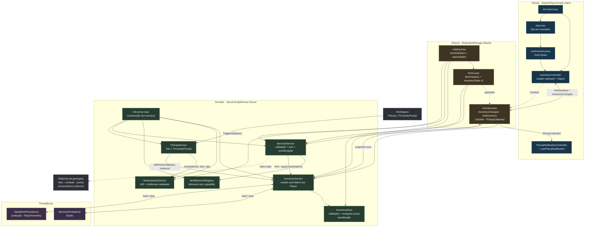
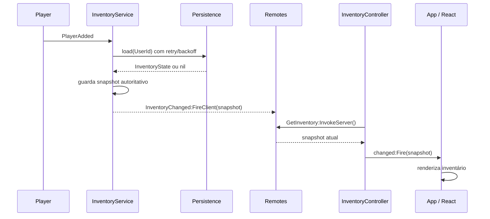
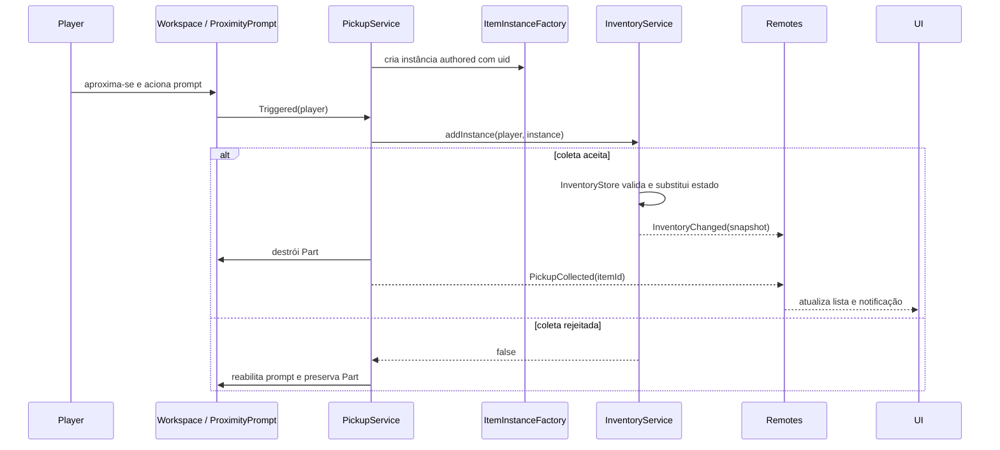
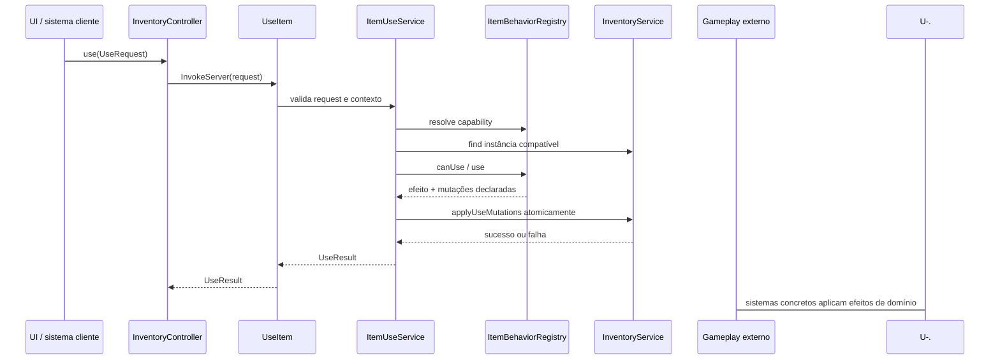
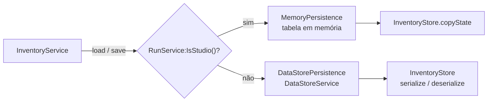

# Arquitetura do Sistema de Inventário

Este documento descreve a arquitetura implementada atualmente em `src/`, sem
propor alterações de comportamento.

## Visão Geral

O servidor é a autoridade do inventário. O cliente recebe snapshots somente
para leitura e envia pedidos de uso por remotes Roblox. O estado é representado
por instâncias concretas de itens, enquanto o catálogo compartilhado define os
metadados e as capacidades disponíveis.



## Componentes

| Componente | Responsabilidade atual |
| --- | --- |
| `shared/inventory/catalog.luau` | Catálogo declarativo com nome, categoria, regra de empilhamento e capacidades. |
| `shared/inventory/items.luau` | Tipos compartilhados de `ItemInstance`, `InventoryState`, pedidos e resultados de uso. |
| `shared/remotes.luau` | Cria ou reutiliza os remotes em `ReplicatedStorage.Remotes`. |
| `server/inventory/InventoryStore.luau` | Valida, copia e transforma estados sem mutação compartilhada; também serializa e desserializa JSON. |
| `server/inventory/InventoryService.luau` | Mantém o estado por jogador, carrega, salva, aplica mutações e replica snapshots. |
| `server/items/ItemInstanceFactory.luau` | Gera `uid`s e cria instâncias com quantidade e atributos básicos válidos. |
| `server/items/ItemBehaviorRegistry.luau` | Registra handlers server-side por capability. |
| `server/items/ItemUseService.luau` | Valida pedidos, encontra a instância compatível, impede uso concorrente e coordena mutações. |
| `server/pickups/PickupService.luau` | Cria pickups no mundo e transfere instâncias ao inventário após `ProximityPrompt.Triggered`. |
| `client/inventory/InventoryController.luau` | Mantém a réplica local e expõe o snapshot para a UI. |
| `client/inventory/useInventory.luau` | Faz a ponte entre o `Signal` do controller e o estado React. |
| `client/ui/App.luau` | Renderiza a lista de itens e a notificação de coleta. |

## Modelo de Dados

```lua
type ItemInstance = {
    uid: string,
    itemId: string,
    quantity: number?,
    attributes: { [string]: string | number | boolean }?,
}

type InventoryState = {
    version: number, -- atualmente 2
    items: { ItemInstance },
    equipped: { [string]: string }, -- slot -> uid
}
```

O `itemId` aponta para uma definição estática do catálogo. O `uid` identifica
uma instância concreta, permitindo que duas instâncias do mesmo tipo tenham
atributos diferentes. Itens empilháveis usam `quantity`.

## Fluxos Principais

### 1. Carregamento e sincronização inicial



Em `Studio`, `MemoryPersistence` é usado. Fora do `Studio`, o backend é
`DataStorePersistence`. O personagem só é carregado depois que o inventário
do jogador termina de carregar. Ao sair, `InventoryService` salva o snapshot
de forma best-effort.

### 2. Coleta de pickup



O cliente não solicita a coleta. A autoridade é o callback server-side do
`ProximityPrompt`.

### 3. Uso de item



`ItemUseService` mantém um lock por jogador, revalida a instância e só aplica
as mutações depois que o behavior retorna dados de resultado. O payload do
cliente não define valores de efeito.

### 4. Persistência



## Autoridade e Limites

- O estado autoritativo fica privado dentro de `InventoryService`.
- `InventoryStore` não depende de APIs Roblox e opera como lógica pura.
- O cliente não altera o inventário diretamente.
- `InventoryChanged` representa snapshots persistíveis; `PickupCollected`
  representa o evento transitório da coleta.
- O catálogo não contém funções nem comportamentos executáveis.
- Behaviors concretos de vida, combate, portas e outros domínios são externos ao
  núcleo do inventário.

## Localização no Projeto

```text
src/shared/inventory/catalog.luau
src/shared/inventory/items.luau
src/shared/remotes.luau

src/server/init.server.luau
src/server/inventory/InventoryStore.luau
src/server/inventory/InventoryService.luau
src/server/inventory/persistence/MemoryPersistence.luau
src/server/inventory/persistence/DataStorePersistence.luau
src/server/items/ItemInstanceFactory.luau
src/server/items/ItemBehaviorRegistry.luau
src/server/items/ItemUseService.luau
src/server/pickups/PickupService.luau

src/client/init.client.luau
src/client/inventory/InventoryController.luau
src/client/inventory/useInventory.luau
src/client/pickups/PickupNotificationController.luau
src/client/pickups/usePickupNotification.luau
src/client/ui/App.luau
```
